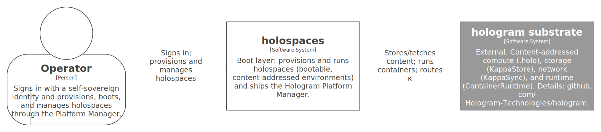

# Context and Scope

<figure>

</figure>

## Business Context

holospaces sits between an *operator* and the things they want to run.

| Partner                   | Input to holospaces                                                                                                                                                                                                          | Output from holospaces                                                                                                                                                                                                                 |
|---------------------------|------------------------------------------------------------------------------------------------------------------------------------------------------------------------------------------------------------------------------|----------------------------------------------------------------------------------------------------------------------------------------------------------------------------------------------------------------------------------------|
| **Operator**              | Sign-in (a self-sovereign identity); a holospace to provision — a holo-file or a git repo + devcontainer; lifecycle commands (boot/suspend/resume/migrate/terminate); edits and terminal commands in a workspace projection. | A rendered view of their holospaces and the substrate; booted, manageable holospaces; a **workspace projection** (editor, file tree, and terminal) over a running holospace; state that follows them across their signed-in instances. |
| **A provisioning source** | A `.holo` artifact, or a git repository with a valid `devcontainer.json` and its operating-system image.                                                                                                                     | A κ-addressed *holospace definition* derived from it (reproducible: same input → same κ).                                                                                                                                              |

The operator experience is a familiar virtualization / container
management console (in the manner of [Proxmox](https://www.proxmox.com),
vSphere, or [Docker
Desktop](https://www.docker.com/products/docker-desktop/)). The novelty
is underneath, not in the interaction model.

## Technical Context

holospaces realizes itself entirely on the
[hologram](https://github.com/Hologram-Technologies/hologram) substrate;
it adds no parallel infrastructure (Law L4).

| External system                | Relationship                                                                                                                                                                                                                                                                                                                   | Reference (authoritative elsewhere)                 |
|--------------------------------|--------------------------------------------------------------------------------------------------------------------------------------------------------------------------------------------------------------------------------------------------------------------------------------------------------------------------------|-----------------------------------------------------|
| **hologram substrate**         | holospaces stores/fetches content, routes κ-labels, runs containers, and executes `.holo` artifacts through hologram’s storage (KappaStore), network (KappaSync), runtime (ContainerRuntime), and executor — whose names and contracts are defined by [hologram](https://github.com/Hologram-Technologies/hologram), not here. | <https://github.com/Hologram-Technologies/hologram> |
| **UOR-ADDR**                   | Supplies the κ-label (content address) form and canonicalization that holospaces' canonical forms use.                                                                                                                                                                                                                         | <https://github.com/UOR-Foundation/uor-addr>        |
| **GitHub Pages**               | Cold-start delivery of the Hologram platform κ; an untrusted, content-addressed gateway — every byte is verified by re-derivation (Law L5).                                                                                                                                                                                    | <https://docs.github.com/pages>                     |
| **Git hosts / OCI registries** | Provisioning sources for devcontainer holospaces; their content (repo trees, image layers) is ingested at the boundary and κ-addressed (Law L2).                                                                                                                                                                               | (per source)                                        |

Scope boundaries: holospaces is the **boot/run/manage** layer. It
implements **no platform-type specifics** — model compilation (ONNX/GGUF
→ `.holo`) belongs to
[hologram-ai](https://github.com/Hologram-Technologies/hologram-ai); the
substrate’s storage/network/runtime contracts belong to
[hologram](https://github.com/Hologram-Technologies/hologram).
holospaces consumes those; it does not redefine them.
