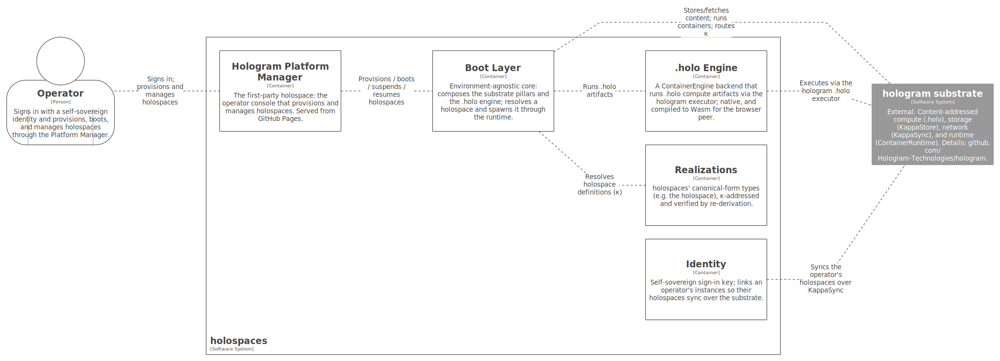

# Building Block View

## Whitebox Overall System

holospaces, opened, is a thin set of building blocks over the
[hologram](https://github.com/Hologram-Technologies/hologram) substrate.
None of them re-implement substrate functionality; they compose it.

<figure>

</figure>

| Building block           | Responsibility                                                                                                                                                                                                                                                                                                                                                                                      |
|--------------------------|-----------------------------------------------------------------------------------------------------------------------------------------------------------------------------------------------------------------------------------------------------------------------------------------------------------------------------------------------------------------------------------------------------|
| **Realizations**         | holospaces' canonical-form types — chiefly the **holospace** (the κ-addressed bootable unit). Each is IRI-tagged canonical bytes, κ-addressed and verified by re-derivation, using [UOR-ADDR](https://github.com/UOR-Foundation/uor-addr).                                                                                                                                                          |
| **Boot Layer**           | The environment-agnostic core: resolve a holospace κ, fetch and verify its parts, and spawn it through hologram’s ContainerRuntime with its capabilities; drive the lifecycle.                                                                                                                                                                                                                      |
| **.holo Engine**         | Runs `.holo` (tensor) compute artifacts via the [hologram](https://github.com/Hologram-Technologies/hologram) executor (`hologram-exec`) — a compute path distinct from the container runtime. Native, and compiled to Wasm for the browser peer.                                                                                                                                                   |
| **Execution Surface**    | The κ-addressed Wasm code-module contract a holospace’s code binds — the `hologram` host ABI and the container ABI — defined and enforced here; the substrate’s `ContainerRuntime` (over a per-environment `ContainerEngine`) boots it. (ADR-008’s contract, generalized by ADR-009.)                                                                                                               |
| **System Emulator**      | The execution codemodule for a general operating system (ADR-009): a system emulator compiled to Wasm and bound to the host ABI, computing an **arbitrary** OS from κ-addressed content — the OS image as content-addressed blocks, console/input/network as hologram channels, running state as a κ snapshot. Imported and verified like any κ. Starts with Linux; generalizes to any OS it boots. |
| **Identity**             | Self-sovereign sign-in key and the multi-instance sync keying (an operator’s instances discover and synchronise their holospaces over the substrate).                                                                                                                                                                                                                                               |
| **Platform Manager**     | The management **projection** (Chapter 8): the operator GUI — served from GitHub Pages — that signs in, provisions, and manages holospaces. Itself a holospace.                                                                                                                                                                                                                                     |
| **Workspace Projection** | The Codespaces/Gitpod **projection** (ADR-009; Chapter 8): a browser editor, file tree, and terminal over a **running** holospace — reading its environment content by κ and publishing operator input as canonical events on its channels. A view + intent surface over content, not a server.                                                                                                     |

## Level 2

The Boot Layer is the hub: it depends on Realizations (to resolve a
holospace), on the Execution Surface (the host-ABI contract a
holospace’s code binds) and the **System Emulator** codemodule it boots
for a general OS, on the .holo Engine (for a holospace whose code is a
`.holo`), and on the hologram substrate (storage / network / runtime).
The Platform Manager projection drives the Boot Layer; a Workspace
Projection renders and drives a running holospace; Identity scopes what
the operator’s instances share and sync. The substrate’s contracts —
KappaStore, KappaSync, ContainerRuntime + its `ContainerEngine`
backends, the content-addressed import (`get_with_fetch`), and the
`.holo` executor — are defined in
[hologram](https://github.com/Hologram-Technologies/hologram) and
consumed here by reference.

## Level 3

The Level-3 (component) responsibilities of the building blocks follow
from the design:

**Boot Layer** — an *Ingestor* (canonicalizes a provisioning source, a
git repo + devcontainer or a holo-file, at the boundary into κ-addressed
content, Law L2); a *Resolver* (resolves a holospace κ, fetching and
verifying its parts, Law L5); a *Spawner* (instantiates the holospace
through the substrate runtime with its capabilities); and a *Lifecycle*
component (suspend → κ snapshot, resume, migrate, terminate).

**.holo Engine** — binds hologram’s `.holo` executor
(`` hologram-exec’s `InferenceSession ``) to run a tensor `.holo` and
content-address its outputs. This is a distinct compute path, **not**
the runtime’s `ContainerEngine` (hologram’s runtime does not link the
tensor engine); see
[hologram](https://github.com/Hologram-Technologies/hologram) for the
executor contract. In the browser peer this binding is the executor
compiled to Wasm.

**Execution Surface** — the κ-addressed Wasm code-module form and a
*surface validator* (a code module imports only the `hologram` host ABI
and presents the container ABI). It is the contract any holospace’s code
binds, without a second execution medium (ADR-008’s contract,
generalized by ADR-009); the code κ feeds the Boot Layer’s Spawner,
which boots it through hologram’s `ContainerRuntime` over the peer’s
`ContainerEngine` — Wasmtime natively, the `wasmi` interpreter in the
browser and on bare-metal.

**System Emulator** — for a general operating system, the execution
codemodule (ADR-009): a real RISC-V machine (RV64GC (= IMAFDC) + Zicsr,
machine/supervisor traps, Sv39/Sv48/Sv57 paging, CLINT interrupts, SBI)
bound to the host ABI and verified against the official riscv-tests
conformance suite (`CC-9`). A *κ-disk* (a `KappaStore`-backed block
device — the OS image and repository as κ-addressed blocks) is its
storage; its console / input / network are bound to hologram channels;
its running state is a κ snapshot. It is itself a κ-addressed code
module satisfying the Execution Surface — imported and verified
trustlessly (`get_with_fetch`). It computes an arbitrary OS image;
holospaces starts with Linux.

**Identity** — a *Key store* (the self-sovereign sign-in key) and a
*Sync binding* (scopes which content an operator’s instances announce
and resolve over the substrate).

**Platform Manager** — a *View* (a projection of the operator’s
holospaces and the substrate) and an *Intent* surface (lifecycle and
provisioning actions); its own state is canonical and held in the store
(Law L2). The management projection (Chapter 8).

**Workspace Projection** — an *Editor / FS view* (the running
holospace’s environment content, read by κ) and a *Terminal / Intent*
surface (operator input published as canonical events on the holospace’s
channels). It holds no state of its own (Law L3); a uor-native rendering
of a running holospace, launched from the Platform Manager — the
Codespaces/Gitpod experience (ADR-009; Chapter 8, *Projection*).

Each component realizes the Architecture Decisions of Chapter 9 and
applies the Concepts of Chapter 8.
