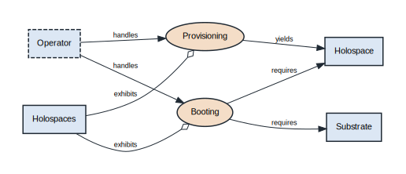
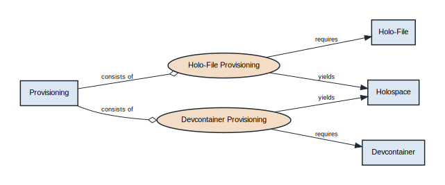
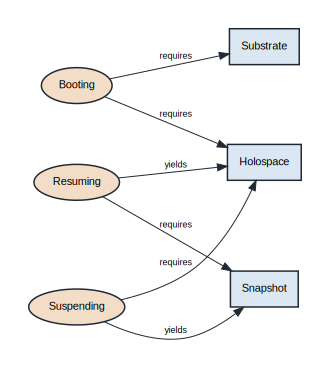
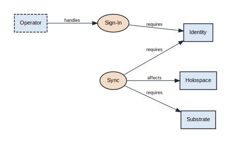
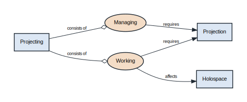
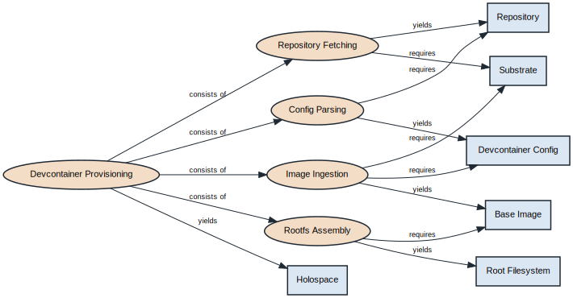

# Conceptual Model

# Conceptual Model

The holospaces conceptual model in Object-Process Methodology (OPM, ISO 19450). The top-level System Diagram (SD) presents holospaces at its highest abstraction — the **Provisioning**, **Booting**, and **Projecting** processes the operator handles; each in-zoom diagram refines one part — **SD1** provisioning, **SD2** the lifecycle (boot · suspend · resume · migrate · terminate), **SD3** identity and sync, **SD4** projecting (managing holospaces and working in one through a projection), **SD5** the in-zoom of devcontainer provisioning (how a devcontainer becomes a holospace — fetching the repository, parsing its config, ingesting the base image, and assembling the root filesystem). Each diagram is bimodal: an Object-Process Diagram (OPD) paired with equivalent Object-Process Language (OPL) sentences.

Scope: the substrate is modeled as a single external object (`Substrate`); its internal pillars are defined by [hologram](https://github.com/Hologram-Technologies/hologram), not here. Peer deployment topology (browser / native / bare-metal) is described in the Deployment View (arc42 chapter 7), not modeled as an OPD.

## SD



```opl
Operator is environmental and physical.
Holospaces is informatical.
Substrate is informatical.
Holospace is informatical.
Provisioning is informatical.
Booting is informatical.
Projecting is informatical.
Holospaces exhibits Provisioning and Booting.
Holospaces exhibits Projecting.
Operator handles Provisioning.
Operator handles Booting.
Operator handles Projecting.
Provisioning yields Holospace.
Booting requires Holospace.
Booting requires Substrate.
Projecting requires Holospace.
```

## SD1 Provisioning



```opl
Provisioning is informatical.
Holo-File Provisioning is informatical.
Devcontainer Provisioning is informatical.
Holo-File is informatical.
Devcontainer is informatical.
Holospace is informatical.
Provisioning consists of Holo-File Provisioning and Devcontainer Provisioning.
Holo-File Provisioning requires Holo-File.
Devcontainer Provisioning requires Devcontainer.
Holo-File Provisioning yields Holospace.
Devcontainer Provisioning yields Holospace.
```

## SD2 Lifecycle



```opl
Holospace is informatical.
Booting is informatical.
Suspending is informatical.
Resuming is informatical.
Migrating is informatical.
Terminating is informatical.
Snapshot is informatical.
Substrate is informatical.
Booting requires Holospace.
Booting requires Substrate.
Suspending requires Holospace.
Suspending yields Snapshot.
Resuming requires Snapshot.
Resuming yields Holospace.
Migrating requires Snapshot.
Migrating yields Holospace.
Terminating requires Holospace.
```

## SD3 Identity



```opl
Operator is environmental and physical.
Identity is informatical.
Sign-In is informatical.
Sync is informatical.
Holospace is informatical.
Substrate is informatical.
Operator handles Sign-In.
Sign-In requires Identity.
Sync requires Identity.
Sync requires Substrate.
Sync affects Holospace.
```

## SD4 Projecting



```opl
Projecting is informatical.
Managing is informatical.
Working is informatical.
Projection is informatical.
Holospace is informatical.
Projecting consists of Managing and Working.
Managing requires Projection.
Working requires Projection.
Working affects Holospace.
```

## SD5 Devcontainer



```opl
Devcontainer Provisioning is informatical.
Repository Fetching is informatical.
Config Parsing is informatical.
Image Ingestion is informatical.
Rootfs Assembly is informatical.
Repository is informatical.
Devcontainer Config is informatical.
Base Image is informatical.
Root Filesystem is informatical.
Holospace is informatical.
Substrate is informatical.
Devcontainer Provisioning consists of Repository Fetching, Config Parsing, Image Ingestion, and Rootfs Assembly.
Repository Fetching requires Substrate.
Repository Fetching yields Repository.
Config Parsing requires Repository.
Config Parsing yields Devcontainer Config.
Image Ingestion requires Devcontainer Config.
Image Ingestion requires Substrate.
Image Ingestion yields Base Image.
Rootfs Assembly requires Base Image.
Rootfs Assembly yields Root Filesystem.
Devcontainer Provisioning yields Holospace.
```

